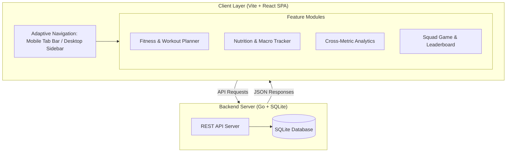
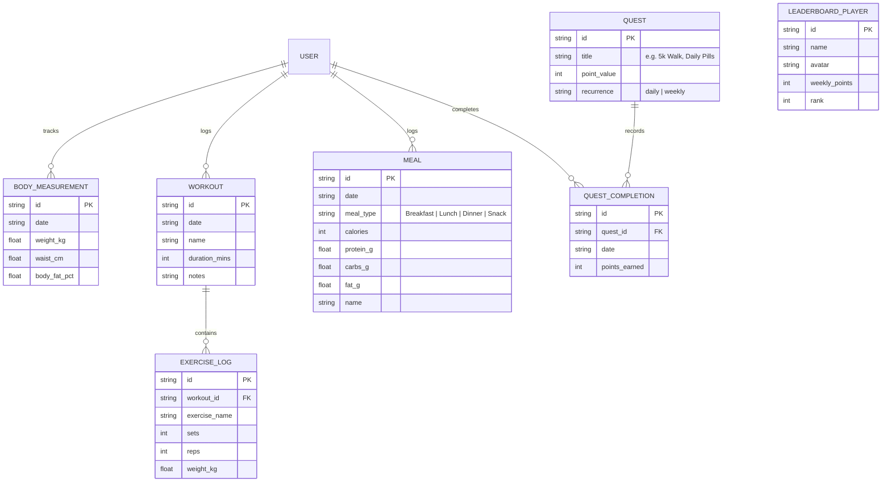
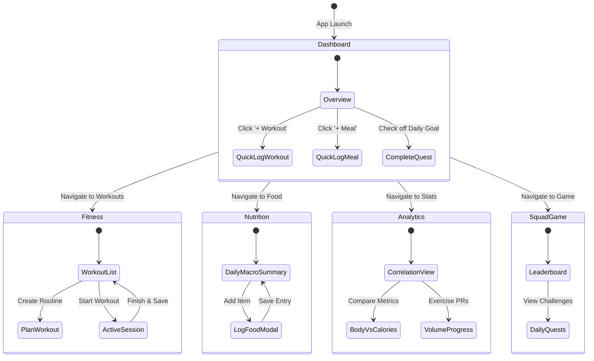
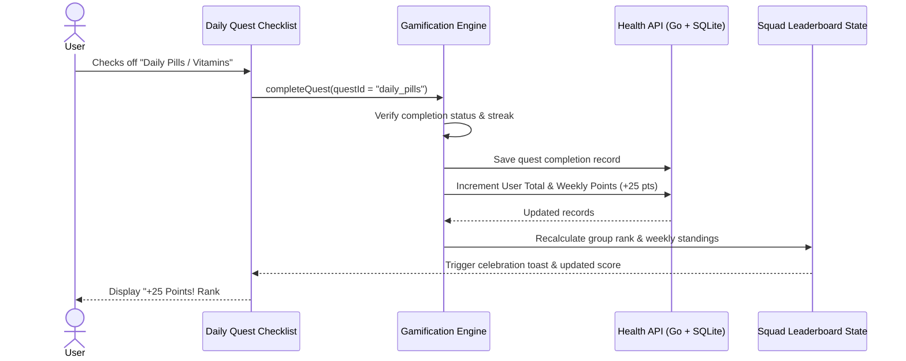
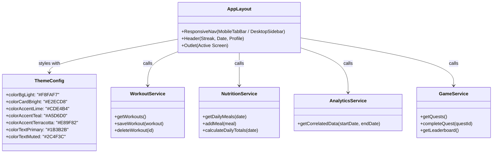

# Health App: Architecture & Implementation Plan

This document defines the complete technical implementation plan for the Health & Fitness App, using a **modern web stack (Vite + React + Tailwind CSS)** with a **minimal Go backend** and **SQLite database**. The frontend is a **Mobile-First, installable Progressive Web App (PWA)** that also adapts to desktop screens. It is online-first: it does not cache API data for offline use (see [Offline support](#offline-support)).

---

## 0. Current Project State

### Completed
- **Project Scaffolding**: Vite + React + TypeScript initialized in `frontend/`, Go module initialized in `backend/`.
- **Linting & Formatting**: ESLint (flat config) and Prettier configured and passing.
- **Design System & Styling**: Tailwind CSS v4 configured with custom color tokens in `frontend/src/index.css`.
- **Frontend Feature Views**: UI implemented across all primary feature routes (Dashboard, Fitness, Food, Squad, Stats), backed by a shared `ApiClient` and a `DataBoundary` loading/error boundary.
- **QA Mock Fixtures**: `frontend/vite/mockApiPlugin.ts` serves `frontend/src/lib/mockData.json` over real HTTP from a Vite middleware, enabled with `npm run dev:mock`. The app has no mock-mode branching, so QA exercises the same code path as production.
- **Backend Scaffold**: Basic Go HTTP server with routing and structured logging initialized in `backend/main.go`.

### Pending
- **Data Persistence & Database Integration**: Connect Go backend to SQLite with migrations, CRUD endpoints, and JSON export/import.
- **Backend API Endpoints**: Implement `/api/dashboard`, `/api/fitness`, `/api/food`, `/api/squad`, and `/api/stats`. Until they exist the frontend surfaces a visible error state rather than silently falling back to fixtures.
- **Automated Tests**: Expand coverage; backend tests are not yet written.

### Offline support

The app is **online-first and intentionally not offline-capable**. It is installable as a PWA (web app manifest plus a service worker that precaches the app shell), but the service worker has **no runtime caching**: `/api/*` responses are never cached, so a network failure is a genuine failure and renders an error state with a retry action. There is no localStorage/IndexedDB cache of domain data and no offline mutation queue.

For UI work without a backend, use `npm run dev:mock` (add `VITE_MOCK_LATENCY_MS=800` to exercise loading states). This is a testing tool, not an offline mode.

---

## 1. Executive Summary & Technology Stack
| :----------------------- | :-------------------------------------- | :--------------------------------------------------------------------------------------------------------------------------------------------------- |
| **Framework / Build**    | **Vite + React (TypeScript)**           | Instant local boot time (`npm run dev`), zero mobile toolchain friction, standard web DOM/HTML/CSS.                                                  |
| **Styling & Theme**      | **Tailwind CSS**                        | Strict adherence to the palette in `docs/humans/design/colors.md` using custom CSS variables (bright tones for UI/cards, dark tones for text/icons). |
| **Backend & Database**   | **Go + SQLite**                         | Lightweight HTTP server with in-process SQLite database for user data, leaderboards, and quest tracking.                                             |
| **Frontend & Static**    | **Vite + Static Assets**                | Served by the Go backend; PWA manifest and service worker precache the app shell for installability. API responses are never cached.                          |
| **Data Visualization**   | **Recharts**                            | Lightweight, responsive SVG charts for cross-metric correlation (e.g., Calorie intake vs. Body measurements).                                        |
| **Iconography**          | **Lucide React**                        | Clean, accessible vector icons for mobile tab bars and dashboard widgets.                                                                            |
| **Deployment / Target**  | **PWA (Mobile & Desktop)**              | Installable to mobile home screen (standalone window, no address bar) and responsive desktop web layout.                                                |

---

## 2. System Architecture (Flowchart)

The application runs as a local Go server with a SQLite backend, with all user data persisted on the server and accessible to all users.

---

## 3. Data Schema & Relationships (Entity-Relationship Diagram)

All entities are persisted locally. Cross-metric analysis queries both `MEAL` and `BODY_MEASUREMENT` across shared date ranges.

---

## 4. User Journey & Navigation (State Diagram)

The user experience transitions seamlessly between views with persistent bottom tabs on mobile and a sidebar on desktop.

---

## 5. Gamification Points Engine (Sequence Diagram)

When an objective is completed (taking vitamins, hitting 5k steps, recording a workout), points are calculated and credited locally.

---

## 6. Component Hierarchy & Design System (Class Diagram)

Adhering to `docs/humans/design/colors.md`:

- **UI elements (buttons, cards, progress rings, badges):** Bright palette tones.
- **Typography and icons:** Dark forest green and deep navy teal.

> **Note:** Component hierarchy is planned but not yet implemented. Refer to Phase 3 of the roadmap.

---

## 7. Step-by-Step Implementation Roadmap

- [ ] **Phase 1: Project Scaffolding & Design System**
  - Initialize Vite React + TypeScript in `./frontend`.
  - Install and configure Tailwind CSS with custom palette color tokens.
  - Setup local responsive layout frame (Mobile container with Desktop sidebar fallback).
- [ ] **Phase 2: Backend & Data Models**
  - Implement the Go API with SQLite schema and migrations.
  - Add simple export/import JSON utility for backups.
- [ ] **Phase 3: Core Feature Implementation**
  - **Dashboard:** Daily progress rings, quick logging, and quest checklist.
  - **Fitness:** Routine planner and workout session logger.
  - **Food:** Calorie & macro logging (Protein, Carbs, Fats) with daily target progress.
  - **Stats:** Multi-axis interactive chart correlating Calorie intake vs. Weight/Measurements.
  - **Squad Game:** Mutual goals, points engine, and local simulated leaderboard.

> **Current Status:** All features are planned but not yet implemented.
- [x] **Phase 4: PWA Packaging & Polish**
  - Web App Manifest and Service Worker for home-screen installability (done: precaches app shell only, no runtime caching).
  - Verify WCAG contrast and palette constraints.
