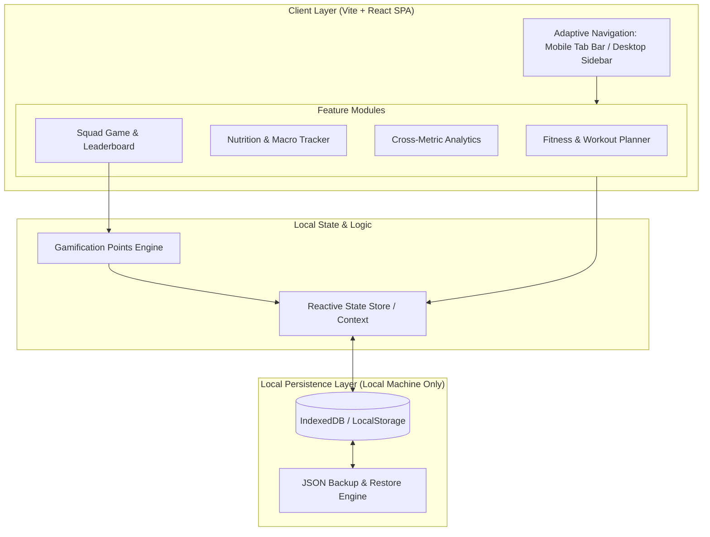
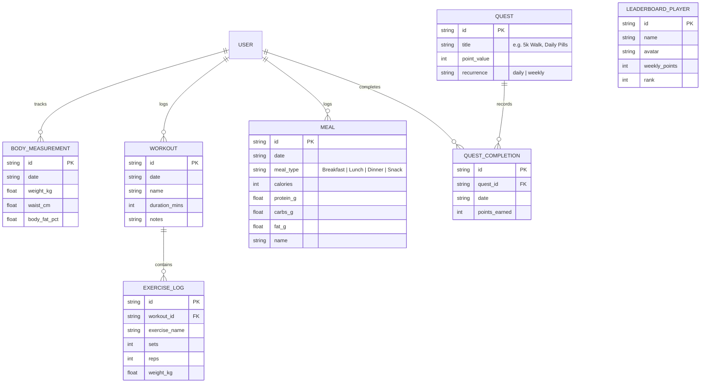
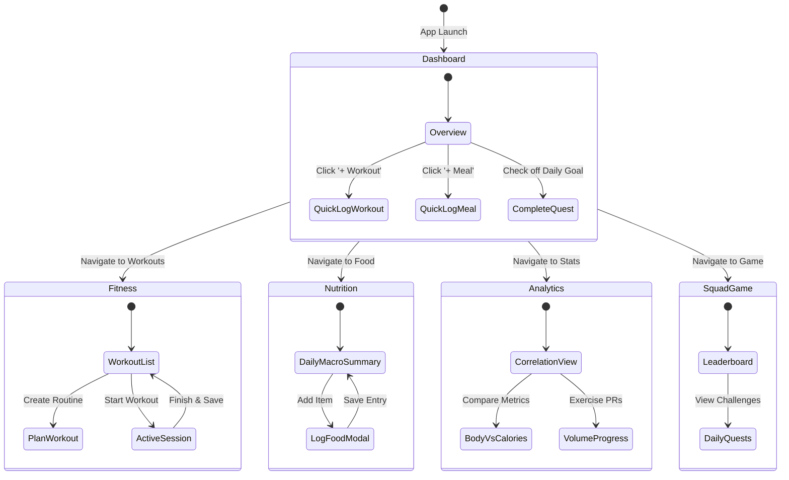
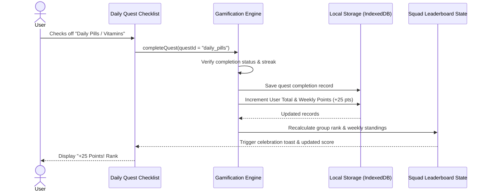
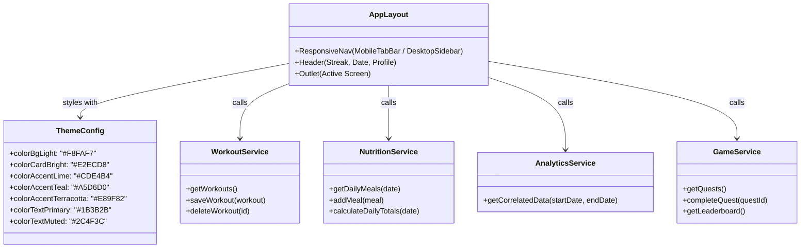

# Health App: Architecture & Implementation Plan

This document defines the complete technical implementation plan for the Health & Fitness App, tailored to run **strictly locally** without external web services, using a **modern web stack (Vite + React + Tailwind CSS)** configured as a **Mobile-First Progressive Web App (PWA)** that also adapts to desktop screens.

---

## 1. Executive Summary & Technology Stack

| Layer | Technology | Rationale |
| :--- | :--- | :--- |
| **Framework / Build** | **Vite + React (TypeScript)** | Instant local boot time (`npm run dev`), zero mobile toolchain friction, standard web DOM/HTML/CSS. |
| **Styling & Theme** | **Tailwind CSS** | Strict adherence to the palette in `docs/humans/design/colors.md` using custom CSS variables (bright tones for UI/cards, dark tones for text/icons). |
| **Storage (Local-Only)** | **IndexedDB (`idb-keyval` / Dexie.js)** | 100% offline and local on the computer/browser; supports rich relational data without setting up external servers. |
| **Data Visualization** | **Recharts** | Lightweight, responsive SVG charts for cross-metric correlation (e.g., Calorie intake vs. Body measurements). |
| **Iconography** | **Lucide React** | Clean, accessible vector icons for mobile tab bars and dashboard widgets. |
| **Deployment / Target** | **PWA (Mobile & Desktop)** | Installable to mobile home screen (standalone window, no address bar, offline ready) and responsive desktop web layout. |

---

## 2. System Architecture (Flowchart)

The application operates completely offline with an in-browser local storage engine and modular feature layers.

---

## 3. Data Schema & Relationships (Entity-Relationship Diagram)

All entities are persisted locally. Cross-metric analysis queries both `MEAL` and `BODY_MEASUREMENT` across shared date ranges.

---

## 4. User Journey & Navigation (State Diagram)

The user experience transitions seamlessly between views with persistent bottom tabs on mobile and a sidebar on desktop.

---

## 5. Gamification Points Engine (Sequence Diagram)

When an objective is completed (taking vitamins, hitting 5k steps, recording a workout), points are calculated and credited locally.

---

## 6. Component Hierarchy & Design System (Class Diagram)

Adhering to `docs/humans/design/colors.md`:
* **UI elements (buttons, cards, progress rings, badges):** Bright palette tones.
* **Typography and icons:** Dark forest green and deep navy teal.

---

## 7. Step-by-Step Implementation Roadmap

- [ ] **Phase 1: Project Scaffolding & Design System**
  - Initialize Vite React + TypeScript in `./app`.
  - Install and configure Tailwind CSS with custom palette color tokens.
  - Setup local responsive layout frame (Mobile container with Desktop sidebar fallback).
- [ ] **Phase 2: Local Storage & Data Models**
  - Implement IndexedDB helper (`db.ts`) with seed data for initial testing.
  - Add simple export/import JSON utility for backups.
- [ ] **Phase 3: Core Feature Implementation**
  - **Dashboard:** Daily progress rings, quick logging, and quest checklist.
  - **Fitness:** Routine planner and workout session logger.
  - **Food:** Calorie & macro logging (Protein, Carbs, Fats) with daily target progress.
  - **Stats:** Multi-axis interactive chart correlating Calorie intake vs. Weight/Measurements.
  - **Squad Game:** Mutual goals, points engine, and local simulated leaderboard.
- [ ] **Phase 4: PWA Packaging & Polish**
  - Add Web App Manifest and Service Worker for offline support and home-screen installability.
  - Verify WCAG contrast and palette constraints.
