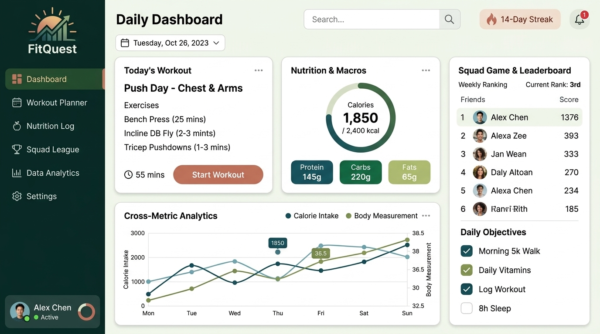
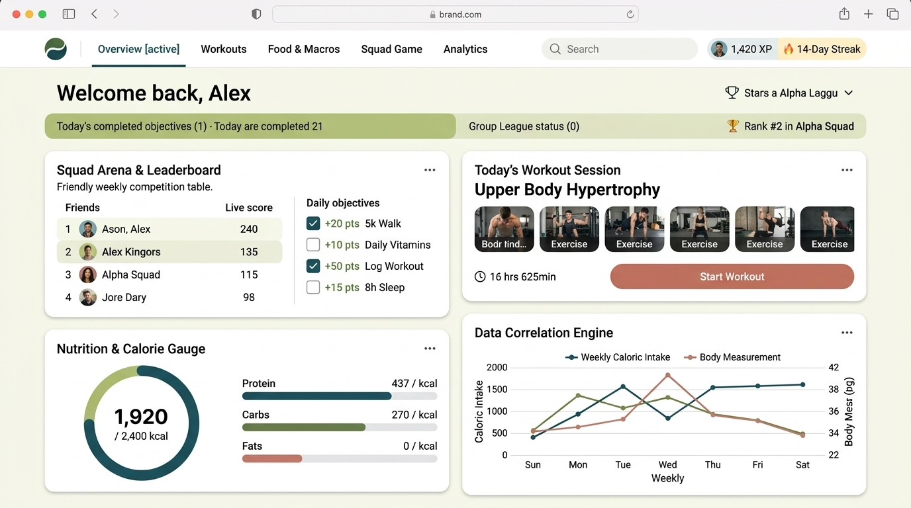

# Landing Screen Concepts (Web App & Responsive)

This document outlines the landing/dashboard screen designs created for the application, addressing both **Desktop PC view** and **Mobile responsive view**.

---

## Option 1: Mobile-First Single-Column Flow
*Ideal for handheld mobile view or centered mobile-frame container.*

### Highlights:
- **Bottom Navigation Bar**: Direct thumb reach for Dashboard, Workouts, Food, Leaderboard, Analytics.
- **Vertical Card Hierarchy**: Daily Quests & Squad score at top, followed by Workout Planner, Calorie Ring, and Data Insights chart.

---

## Option 2: Desktop Web App — Persistent Sidebar Dashboard
*Optimized for widescreen desktop browsers with high data density.*

### Highlights:
- **Collapsible Left Sidebar**: Persistent navigation for quick switching across sections.
- **Multi-Column Grid**: 
  - Main section holds Workout Planning, Nutrition Tracker, and a wide **Cross-Metric Analytics** line chart (Calorie Intake vs. Body Measurements).
  - Dedicated right column keeps the **Squad Game & Leaderboard** and daily checklist (Walk, Pills/Vitamins, Workout, Sleep) always in view.
- **Responsiveness**: Collapses smoothly into a single column with a slide-out hamburger menu on smaller screens.

---

## Option 3: Desktop Web App — Modular Bento Grid Command Center
*Modern bento-card aesthetic with balanced social, fitness, and data emphasis.*

### Highlights:
- **Top Navigation**: Clean header bar with search, XP, and streak badges.
- **Bento Grid Cards**:
  1. **Squad Arena**: Friend leaderboard + daily objective checkboxes (+points).
  2. **Workout Session**: Exercise routine with thumbnail chips and "Start Workout" CTA.
  3. **Nutrition Gauge**: Calorie wheel and macro distribution bars.
  4. **Data Correlation Engine**: Multi-variable progress visualization.
- **Responsiveness**: Bento cards naturally reflow from a 2x2 grid on desktop to a single-column stack on mobile devices.
