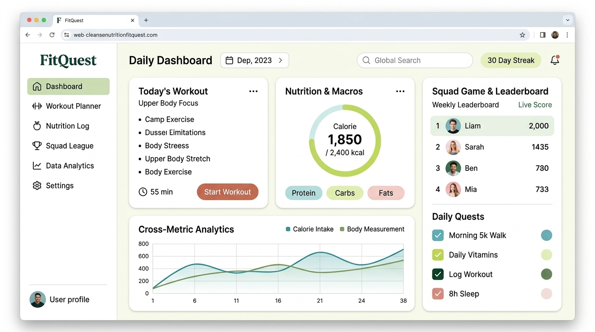

# Landing Screen Design: Bright Sidebar Dashboard (Primary Direction)

This is the primary approved design direction for the application landing/dashboard screen. It uses a **persistent sidebar desktop web layout** with an airy, light-mode aesthetic—using the **brighter palette tones** (pale lime, soft sage, light teal, blush, and terracotta) for cards, progress rings, and interactive widgets, while reserving **dark forest green and deep navy teal for typography, icons, and text**.

---

## 🖥️ Desktop Web App (Bright & Light Mode)

### Design & Color Hierarchy:
- **Sidebar**: Clean, light background with a soft pastel lime active pill and dark forest green typography/icons.
- **Top Header Bar**: Date selector, global search, user profile, and a soft lime `30 Day Streak` indicator.
- **Today's Workout Card**: Light card container with clear exercise breakdown, 55 min estimate, and a terracotta `Start Workout` button.
- **Nutrition & Macros Card**: Bright lime calorie progress wheel (`1,850 / 2,400 kcal`) with macro tags (Protein in light teal, Carbs in soft lime, Fats in blush).
- **Cross-Metric Analytics**: Clean data visualization correlating Calorie Intake with Body Measurements over time.
- **Squad Game & Leaderboard**: Weekly leaderboard rankings and color-coded daily quest checklist (5k Walk, Daily Vitamins, Log Workout, 8h Sleep).

---

## 📱 Mobile Responsive Behavior
On mobile viewports:
- The left sidebar collapses into a top app bar with a hamburger icon and profile pill.
- The cards stack into a clean vertical flow:
  1. **Today's Workout**
  2. **Nutrition & Macros**
  3. **Cross-Metric Analytics**
  4. **Squad Game & Daily Quests**
