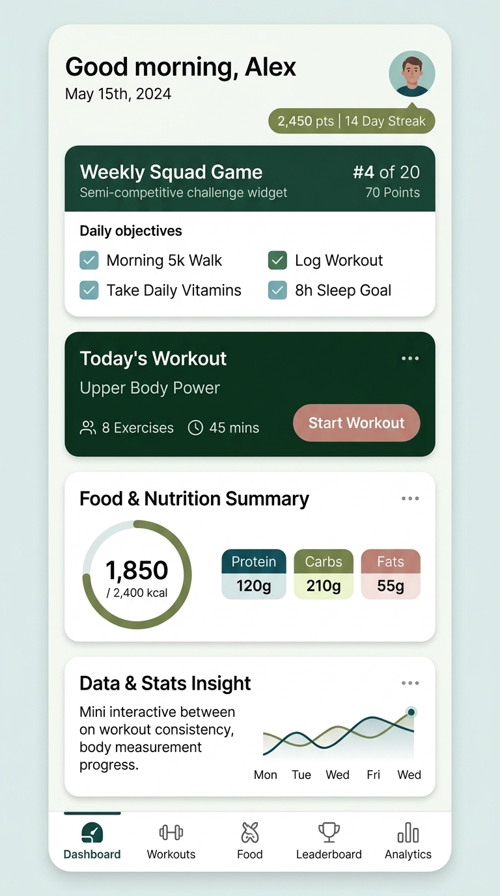

# Landing Screen Concept & Sketch

## Summary of Screen Sections

1. **Header & Streak**: User greeting, date, current points tally, and daily consistency streak badge.
2. **Weekly Squad Game**: Group challenge widget displaying rank (`#4 of 20`), current score, and actionable daily objectives:
   - Walk 5k
   - Take Daily Vitamins
   - Log Workout
   - 8h Sleep Goal
3. **Today's Workout Planner**: Quick preview of today's planned session (*Upper Body Power*, 8 exercises, 45 mins) with a prominent call-to-action button.
4. **Food & Nutrition Summary**: Calorie gauge ring tracking daily progress against target, complemented by macro distribution pills (Protein, Carbs, Fats).
5. **Data & Analytics Insight**: Multi-variable correlation chart comparing workout consistency and body measurement changes over the week.
6. **Navigation**: Tab bar providing instant access to Dashboard, Workouts, Food, Leaderboard, and Analytics.
