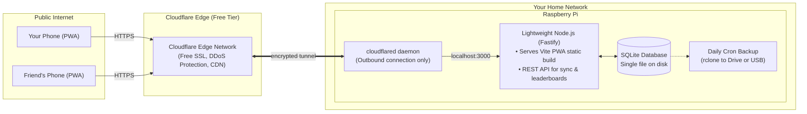

# Raspberry Pi Self-Hosting Guide ($0/Month Stack)

This guide details how to host the Health App on a single Raspberry Pi with **$0 monthly cloud costs**, zero port forwarding, automatic HTTPS, and remote access for your friend group using **Cloudflare Tunnel**.

---

## 1. System Overview & Architecture



---

## 2. Why This Setup Is Ideal for a Raspberry Pi

1. **True $0 / Month:** No VPS, no database hosting bills, no static IP charges.
2. **No Port Forwarding Required:** Cloudflare Tunnel establishes an *outbound* connection from your Pi to Cloudflare's edge. Your home router's firewall stays completely closed, and CGNAT (common with home ISPs) is not an issue.
3. **Automatic SSL / HTTPS:** Cloudflare provisions and renews SSL certificates for free, which is strictly required for mobile PWAs and service workers.
4. **Low Power & Resource Footprint:**
   - **RAM Usage:** Fastify + SQLite uses **< 50 MB** of RAM.
   - **CPU Usage:** Near 0% at idle, negligible during requests.
   - **Storage:** SQLite file stays tiny (under 50 MB for years of workout and meal history).

---

## 3. Step-by-Step Setup Guide

### Step 1: Prepare the Raspberry Pi
Ensure your Raspberry Pi (Raspberry Pi OS / Debian) has Node.js and Git installed.

```bash
# Update package list
sudo apt update && sudo apt upgrade -y

# Install Node.js (v20 LTS or v22)
curl -fsSL https://deb.nodesource.com/setup_22.x | sudo -E bash -
sudo apt install -y nodejs git build-essential

# Verify versions
node -v
npm -v
```

---

### Step 2: Build and Run the App Locally on the Pi
Clone your repository and build the production bundle:

```bash
# Clone project (on the Pi)
git clone <your-repo-url> ~/health-app
cd ~/health-app

# Install dependencies and build frontend
npm install
npm run build

# Start the lightweight production server
npm run start
```

---

### Step 3: Run Continuously via systemd (Auto-Restart on Boot)
Create a systemd service so the app automatically boots up if the Pi restarts (e.g. after a power outage).

Create `/etc/systemd/system/health-app.service`:
```ini
[Unit]
Description=Health App Service
After=network.target

[Service]
Type=simple
User=pi
WorkingDirectory=/home/pi/health-app
ExecStart=/usr/bin/npm run start
Restart=always
RestartSec=10
Environment=NODE_ENV=production
Environment=PORT=3000

[Install]
WantedBy=multi-user.target
```

Enable and start the service:
```bash
sudo systemctl daemon-reload
sudo systemctl enable health-app
sudo systemctl start health-app
sudo systemctl status health-app
```

---

### Step 4: Expose Securely with Cloudflare Tunnel (cloudflared)

1. **Prerequisite:** A domain name managed through Cloudflare (free tier). You can buy a cheap domain for ~$3–$10/year (e.g. `.xyz`, `.me`, or `.top`) or use a free domain provider.
2. **Install `cloudflared` on the Pi:**
   ```bash
   # Add Cloudflare GPG key and repository
   sudo mkdir -p --mode=0755 /usr/share/keyrings
   curl -fsSL https://pkg.cloudflare.com/cloudflare-main.gpg | sudo tee /usr/share/keyrings/cloudflare-main.gpg >/dev/null
   echo 'deb [signed-by=/usr/share/keyrings/cloudflare-main.gpg] https://pkg.cloudflare.com/cloudflared any main' | sudo tee /etc/apt/sources.list.d/cloudflared.list
   
   sudo apt update
   sudo apt install -y cloudflared
   ```
3. **Authenticate & Create Tunnel:**
   ```bash
   # Authenticate with your Cloudflare account
   cloudflared tunnel login
   
   # Create a tunnel named 'health-tunnel'
   cloudflared tunnel create health-tunnel
   ```
4. **Route your Domain to the Tunnel:**
   ```bash
   # Associate subdomain (e.g., app.yourdomain.com) with the tunnel
   cloudflared tunnel route dns health-tunnel app.yourdomain.com
   ```
5. **Configure the Tunnel (`~/.cloudflared/config.yml`):**
   ```yaml
   tunnel: <TUNNEL_UUID>
   credentials-file: /home/pi/.cloudflared/<TUNNEL_UUID>.json

   ingress:
     - hostname: app.yourdomain.com
       service: http://localhost:3000
     - service: http_status:404
   ```
6. **Run Tunnel as a System Service:**
   ```bash
   sudo cloudflared service install
   sudo systemctl start cloudflared
   sudo systemctl enable cloudflared
   ```

Now `https://app.yourdomain.com` will route directly to your Raspberry Pi with full HTTPS, accessible by you and your friends from anywhere in the world!

---

## 4. Zero-Cost Backup Strategy for SQLite

Since SQLite is a single file (e.g. `data/health.db`), backing it up is trivial.

### Option A: Local USB Flash Drive Backup
Plug an inexpensive USB flash drive into the Pi, and add a nightly cron job:
```bash
# Open crontab
crontab -e

# Run safe SQLite backup at 3:00 AM every night
0 3 * * * sqlite3 /home/pi/health-app/data/health.db ".backup '/mnt/usb/backups/health_$(date +\%Y\%m\%d).db'"
```

### Option B: Free Cloud Backup with `rclone`
Use `rclone` (free command-line tool) to mirror daily encrypted database backups to Google Drive, Dropbox, or OneDrive (all within free storage tiers):
```bash
0 3 * * * sqlite3 /home/pi/health-app/data/health.db ".backup /tmp/backup.db" && rclone copy /tmp/backup.db "gdrive:HealthAppBackups"
```

---

## 5. Security & Friend Group Authentication

For a close friend group, you don't need heavy OAuth or complex password resets:
- **Invite Token / Group PIN:** A shared squad invite code (e.g. `FIT-SQUAD-2026`) lets your friends create their profile without public registration spam.
- **Session Tokens:** Simple HTTP-only JWTs or persistent random tokens stored in SQLite.
- **Cloudflare Access (Optional extra layer):** If you want to restrict the URL strictly to specific email addresses, you can turn on Cloudflare Zero Trust Access (Free for up to 50 users).
